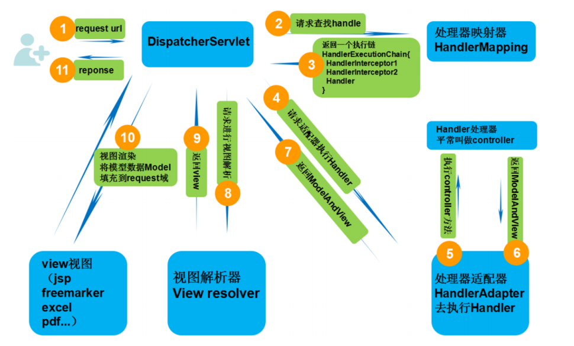

## SpringMVC 运行过程浅谈
我们先总览一下**SpringMVC**的运行过程

### 控制器DispatcherServlet
**DispatcherServlet**作为**前端控制器**，负责**调度流程**，**接收请求**，**返回响应**。
只是按**调度流程**调度组件，不做具体处理。
**DispatcherServlet**接收请求后，会按如下过程处理请求。

---
### 1.HandlerMapping查找Handler
**传入内容：**

* request（URL、HTTP 方法、参数条件等）

**发生的事情：**

* `HandlerMapping` 根据：

  * URL
  * HTTP 方法
  * `@RequestMapping` 条件
* 查找匹配的 Handler
**返回内容：**

* `HandlerExecutionChain`

  * `Handler`（通常是 Controller 方法）
  * `HandlerInterceptor` (SpringMVC拦截器)列表
**说明：**

* HandlerMapping **只做匹配**
* 不执行、不解析参数

---

### 2. 适配器 HandlerAdapter 解析并执行 Handler

**传入内容：**

- `HandlerExecutionChain`
- `HttpServletRequest`
- `HttpServletResponse`

---

**处理过程：**

#### 1. 解析参数

`HandlerAdapter` 在调用 `Controller` 方法之前，会**遍历目标方法的所有参数**，  
并依次遍历已注册的 **`HandlerMethodArgumentResolver`**，通过调用  
`supportsParameter()` 判断是否支持当前参数。

当找到合适的参数解析器后，调用其 **`resolveArgument()`** 方法，  
从 `request` 中获取数据并完成类型转换，最终解析出具体的参数值。

这一步正是 **Controller 方法能够直接拿到参数** 的根本原因。

---

#### 2. 执行方法

在参数全部解析完成后，`HandlerAdapter` 会调用  
**`HandlerMethod` 的 `invoke()` 方法**，  
将解析得到的参数按顺序传入，执行对应的  
**Controller 方法（即我们编写的业务逻辑）**。

---

**返回内容：**

- Controller 方法的返回值，例如：
  - `ModelAndView`
  - 视图名（`String`）
  - 普通对象（用于 JSON 等响应）

这些返回值将交由 Spring MVC 的后续流程进行统一处理。

---

> **说明：**  
> HandlerAdapter 的职责并不包含业务逻辑处理，  
> 它负责完成 HTTP 请求到方法调用之间的“适配”工作。

### 视图解析器viewResolver解析视图
我们所写的`Controller`一般返回的是逻辑视图或者对象，如果是对象一般直接返回，逻辑视图名会交给`ViewResolver`进行解析，返回`View`对象。
例如：
```java
@Controller
public class HelloController {
    @RequestMapping("/hello")
    public String hello() {
        return "hello";
    }
}
```
这里返回的`hello`就是逻辑视图名，逻辑视图名会交给`ViewResolver`进行解析，返回`View`对象(`hello.html`等)。

**传入内容：**

* 逻辑视图名（如 `"userDetail"`）

**发生的事情：**

* `ViewResolver` 将视图名解析为 `View` 对象

**返回内容：**

* `View`（JSP / Thymeleaf / FreeMarker 等）

### 3.视图渲染
**传入内容：**
* Model 数据(`Controller`返回的`ModelAndView`对象里的`Model`数据)
* `View`对象
**发生的事情：**

* 将 Model 数据填充到 request 域
* 调用 `View.render()`
* 渲染页面或生成输出内容
---

###  响应返回客户端

**最终结果：**

* HTML 页面
* 或 JSON / 文件流 / 其他响应
---
### 关键职责对照表

| 组件                | 职责                  |
| ----------------- | ------------------- |
| **DispatcherServlet** | 请求统一入口，流程调度         |
| **HandlerMapping**    | **request → Handler**   |
| **HandlerAdapter**    | 参数解析 + 方法调用         |
| **Controller**        | 业务处理                |
| **ViewResolver**      | 视图名 → **View**          |
| **View**              | 渲染 **Model** 到 **response** |

---

### 结语

Spring MVC 通过 **前端控制器 + 适配器 + 解析器** 的设计，
实现了 **请求分发、参数解析、业务解耦、视图渲染** 的完整闭环，
使 Controller 可以专注于业务逻辑，而无需关心 HTTP 细节。

---