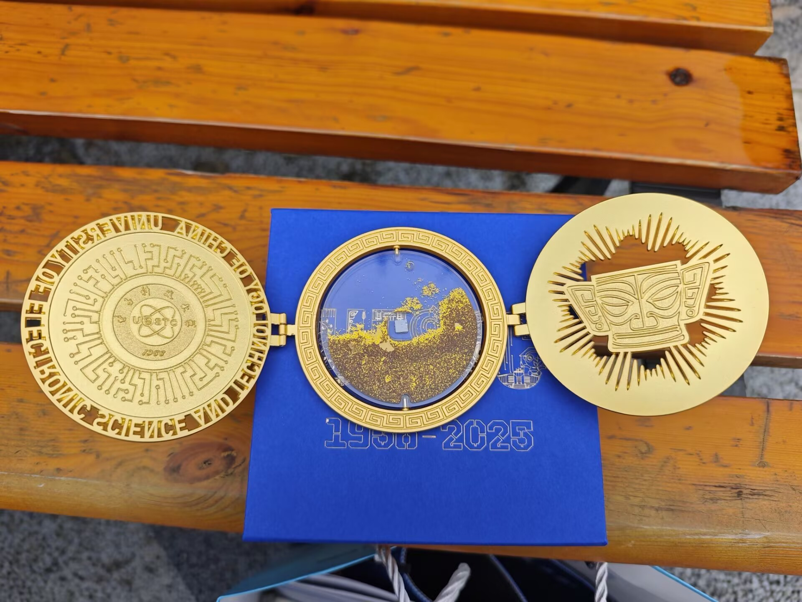
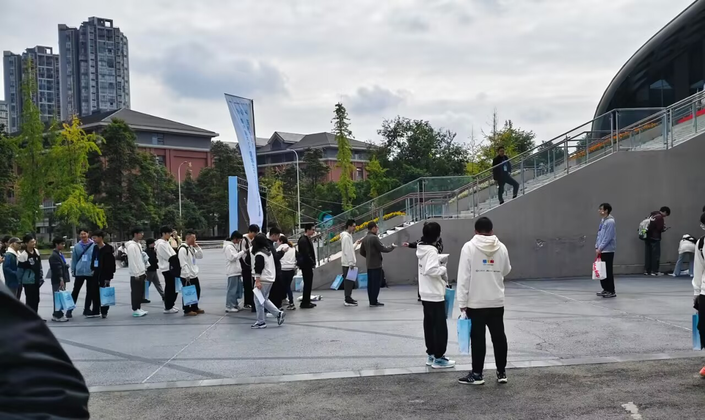
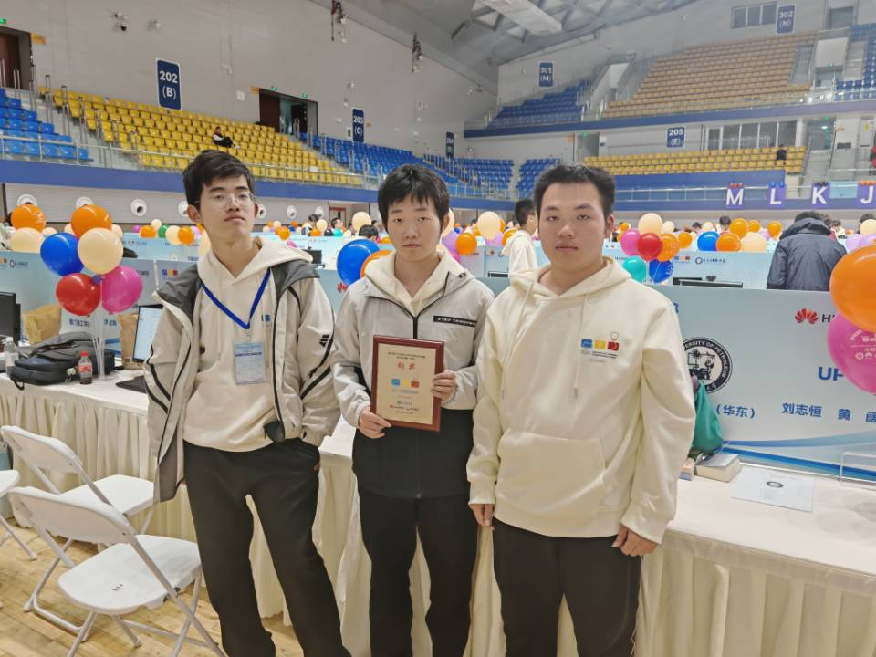

## 概览

算是我第一次正式参加 **ACM 系列赛事**。  
最终只收获了一枚 铜牌，多少有点意难平。

（[**jjgg**](https://space.bilibili.com/4059269) 预测榜是 72，实际打了 132；赛后 VP 基本也能单挑到银，属实有点难绷。）

不过在算法竞赛领域，**意难平几乎是每个有追求的队伍都会经历的常态**。  
赛场的氛围感非常强，紧张、失误才是常态。

> 不过这次的失误，确实有点逆天，后面就知道了。

---

## Day 1

早上起床就听群 U 说 **非凸科技** 在发 **fufu**，而且只需要集够 48 个赞，于是第一时间赶过去。  
可惜活动已经结束，改成了投壶——作为投壶低手，理所当然地没拿到。（悲）

不过 **电子科技大学** 的伴手礼是真的好看。

据说是 **录取通知书** 同款芯片。

下午刚到现场，也非常惊喜地见到了 **哥哥**，可惜人实在太多，没有要到合照。

热身赛打得也挺惊险，用了一些神秘算法 **AK**，最后两分钟才**C**才 Accept。

赛后也是面基了好些群U，开心ing。

---

## Day 2

也是我打过 **最逆天** 的一场比赛。

开场三十分钟，在签到题 **G** 上先 WA 了两发。  
现在回头看，代码写得确实没什么道理，结果我们队 **22 分钟才完成签到**。

接着我敲完了另一个签到题 **J**，然后就来到了我本场犯蠢最严重的一题 —— **A**。

A 的构造我整整卡了快两个小时，WA 了四次。  
最后才发现是 **有一种情况没有输出 `Yes`**，当场直接红温。

后面有一题比较板的 **L**，我一眼看出来是 **树上启发式合并**，  
但因为 **01 串输出多了空格** 又 WA，白白浪费了不少时间。

与此同时，另一个队友在看 **B**，但后来发现做法是假的。  
我接手之后想了一会，用 **倍增 + DP** 过了。

可惜前面红温时间太长，人已经很累了，脑子明显跟不上；  
队友状态也没有拉起来，最后 **C** —— 现在看来并不算难的一题 —— 没能拿下。

综合上述种种，我们队最终只拿到了 铜牌。

三个人都算战犯：  
队友没能持续出题，而我在场上犯了太多低级、愚蠢的错误。

---

## 总结

虽然非常意难平，但这次比赛也确实是一种锻炼。  
**ICPC 的赛场，不只是比拼算法实力**，也是与各路志同道合的大佬交朋友的一次经历，本身就已经足够珍贵。

最后引用 [**0x3f**](https://space.bilibili.com/206214) 大佬的一段话，作为结尾:

**"我不太喜欢那种过于功利的竞赛，即使是为了前程，为了利益。即使我不免俗人，但还是希望这种学科竞赛是我和我认为的高手，同台竞技的最后一块净土。**
 
**我希望的竞赛是，我们带着信念而来。我们在这一场马拉松里，也许是对手，也许是队友。当你们在我身边的时候，我能感受到你们的过去现在与未来和我交织；当你们超越我们的时候，我也能看着你们，像一束光。不管奖牌是什么颜色，但是我们，来过这里。**
 
**三言两语诉说不完这里的故事。如果你也怀揣着最纯粹的热爱，那么，欢迎来到这里。"**

