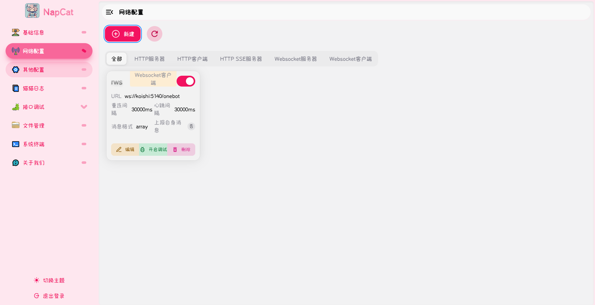

### 概述：

官方的QQbot限制较大，功能也比较少，我们想要的是Bot直接控制QQ账号，但是大部分可能会被腾讯检测制裁

NapCat是一个非常稳定的框架，使用OneBot协议。

官方介绍如下：
**猫猫框架通过魔法的手段获得了 QQ 的发送消息、接收消息等接口。 为了方便使用，猫猫框架将通过一种名为 OneBot 的约定将你的 HTTP / WebSocket 请求按照规范读取， 再去调用猫猫框架所获得的QQ发送接口之类的接口。**

### 安装Docker
这里推荐使用**Docker**进行部署。
没有的可以使用[宝塔](https://www.bt.cn/)
面板安装**Docker**，可以一键安装。

对于**Ubuntu**用户，可以使用以下命令进行安装：
```bash
#安装依赖
sudo apt update
sudo apt install -y ca-certificates curl gnupg lsb-release
#添加 Docker 官方 GPG key
sudo mkdir -p /etc/apt/keyrings
curl -fsSL https://download.docker.com/linux/ubuntu/gpg | \
sudo gpg --dearmor -o /etc/apt/keyrings/docker.gpg
#添加官方仓库
echo \
"deb [arch=$(dpkg --print-architecture) signed-by=/etc/apt/keyrings/docker.gpg] \
https://download.docker.com/linux/ubuntu \
$(lsb_release -cs) stable" | \
sudo tee /etc/apt/sources.list.d/docker.list > /dev/null
#安装Docker
sudo apt update
sudo apt install -y docker-ce docker-ce-cli containerd.io
```

### 部署NapCat
这里使用**docker-compose**进行部署。
创建一个**docker-compose.yml**文件，内容如下：
```yaml
services:
  napcat:
    container_name: napcat
    image: mlikiowa/napcat-docker:latest
    restart: always
    environment:
      - NAPCAT_UID=${NAPCAT_UID:-1000}
      - NAPCAT_GID=${NAPCAT_GID:-1000}
    ports:
      - 6099:6099
    volumes:
      - ./napcat/config:/app/napcat/config
      - ./ntqq:/app/.config/QQ

```
没有**docker-compose**的可以看[安装教程](https://docs.docker.com/compose/install/)

然后运行命令：
```bash
docker compose up -d
```
启动

访问：
```
http://你的IP:6099
```
就可以进入**NapCat**了

### QQbot配置
在登录完**QQ**账号之后，**NapCat**就可以代理**QQ**了，可以在日志里看到它识别了**QQ**消息。

现在有非常多支持**OneBot**协议的QQbot和框架，这里以**KoiShi**为例。

在**NapCat**的网络代理界面，根据所选的**QQbot**服务器类型创建对应的配置。



如果使用**KoiShi**，把**docker-compose.yml**改为如下配置即可配置好**NapCat**和**KoiShi**
```yaml
services:
  napcat:
    container_name: napcat
    image: mlikiowa/napcat-docker:latest
    restart: always
    environment:
      - NAPCAT_UID=${NAPCAT_UID:-1000}
      - NAPCAT_GID=${NAPCAT_GID:-1000}
      - MODE=koishi
    ports:
      - 6099:6099
    volumes:
      - ./napcat/config:/app/napcat/config
      - ./ntqq:/app/.config/QQ
      - ./koishi:/koishi
    networks:
      - koishi_network
    mac_address: "02:42:ac:11:00:02"

  koishi:
    container_name: koishi
    image: koishijs/koishi:latest
    restart: always
    environment:
      - TZ=Asia/Shanghai
    ports:
      - 5140:5140
    volumes:
      - ./ntqq:/app/.config/QQ
      - ./koishi:/koishi
    networks:
      - koishi_network

networks:
  koishi_network:
    driver: bridge
```
访问
```
http://你的IP:5140
```

下载**OneBot**插件：**koishi-plugin-adapter-onebot**
然后**Koishi**就可以直接控制连接**QQ**账号了

打开插件市场，里面有丰富的插件，需要的功能直接搜索，安装之后根据文档配置完即可获得相应功能。

比如**AI**聊天就可以使用**chatluna**插件，大家可以自行探索。

其他的框架和完整机器人在配置完**NapCat**之后，也可以直接控制**QQ**账号，一般都是**OneBot**协议。