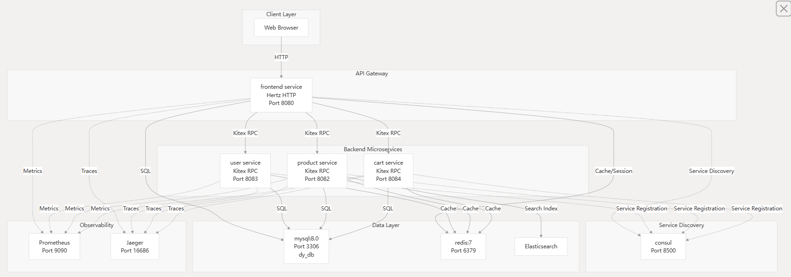

## dy-mallend

> 一个基于 CloudWeGo 技术栈构建的、面向学习的分布式系统示例项目。

---
### 代码仓库

仓库在[https://github.com/MoScenix/dy-mallend](https://github.com/MoScenix/dy-mallend)

**deepwike**的分析在[https://deepwiki.com/MoScenix/dy-mallend/1-overview](https://deepwiki.com/MoScenix/dy-mallend/1-overview)

## 📌 关于本项目

**dy-mallend** 是一个**以学习为目的的示例应用**，主要用于学习和实践：

- 分布式系统
- 微服务架构
- 后端系统设计
- 基础设施与可观测性（Observability）

 **重要声明**

- 本项目 **不是** 真实的电商平台  
- **不涉及** 任何真实支付、交易或商业行为  
- 所有数据与业务行为 **仅用于学习与实验**

本项目由 **MoScenix** 开发与维护。

---
### 架构

##### 架构图：

##  技术栈

| 技术 | 说明 |
| ---- | ---- |
| **cwgo** | CloudWeGo 官方工具链，用于生成 Go 微服务项目脚手架 |
| **Consul** | 服务注册与服务发现 |
| **Kitex** | 高性能 RPC 框架，用于服务间通信 |
| **Hertz** | 高性能 HTTP 框架，用作 API 网关或前端服务 |
| **Tailwind CSS** | 原子化 CSS 框架，用于快速构建现代化、响应式 Web 界面 |
| **MySQL** | 关系型数据库，用于持久化数据存储 |
| **Redis** | 内存型数据存储，用于缓存与性能优化 |
| **Elasticsearch (ES)** | 分布式搜索引擎，用于全文检索 |
| **Prometheus** | 监控系统，用于指标采集与监控 |
| **Jaeger** | 分布式链路追踪系统 |
| **Docker** | 容器化平台 |
---
## 快速开始（部署指南）

本项目支持使用 **Docker Compose** 在本地一键启动，适合学习和调试分布式微服务架构。

### 环境准备

在开始之前，请确保本地已安装以下工具：

- Git
- Docker
- Docker Compose（推荐 v2 及以上版本）

#### 启动步骤

```bash
# 1. 克隆仓库
git clone https://github.com/MoScenix/dy-mallend.git
cd dy-mallend

# 2. 启动所有服务
docker compose up -d

# 3. 查看服务状态

docker compose ps

# 4. 访问前端服务

http://localhost:8080

# 5. 关闭所有服务

docker compose down

# 6. 删除所有数据

docker compose down --vo

```

#### 修改密码

在**docker-compose.yml**文件中,可以修改服务的**environment**参数，修改密码。


#### 分布式参数

对于**consul**作为注册中心的项目需要改**consul_address**参数，这样就可以部署在多个服务器上。

在**docker-compose.yml**文件保存所需的**server**就行。